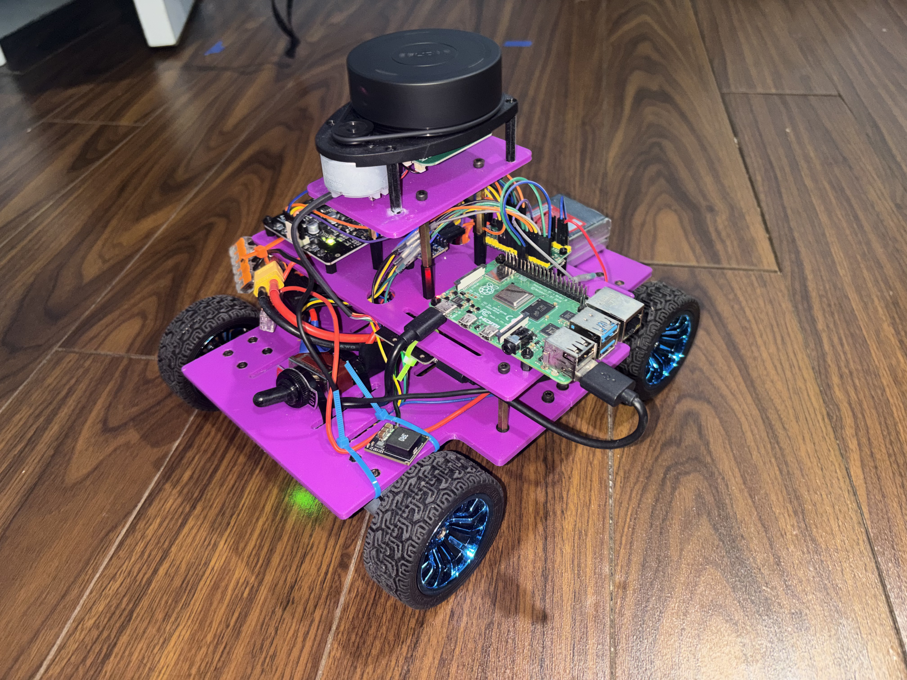
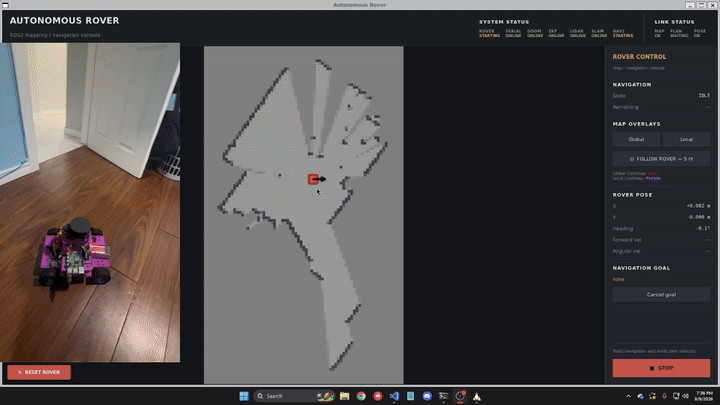
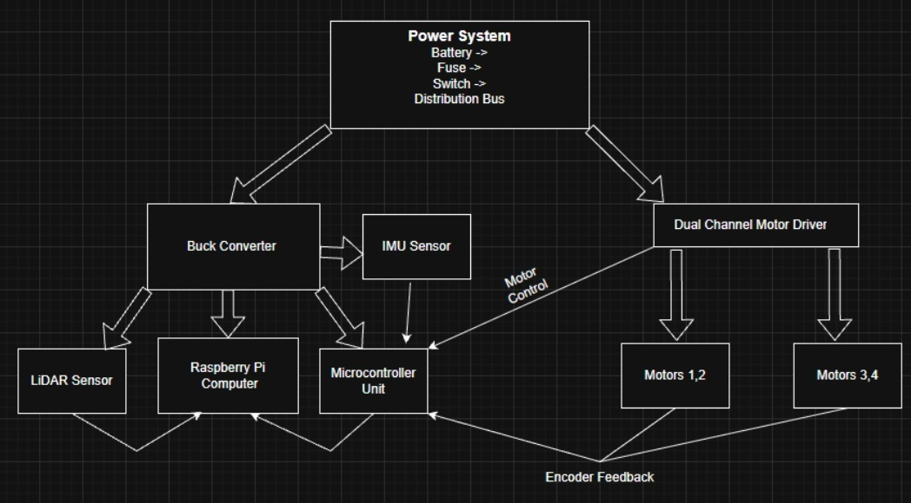
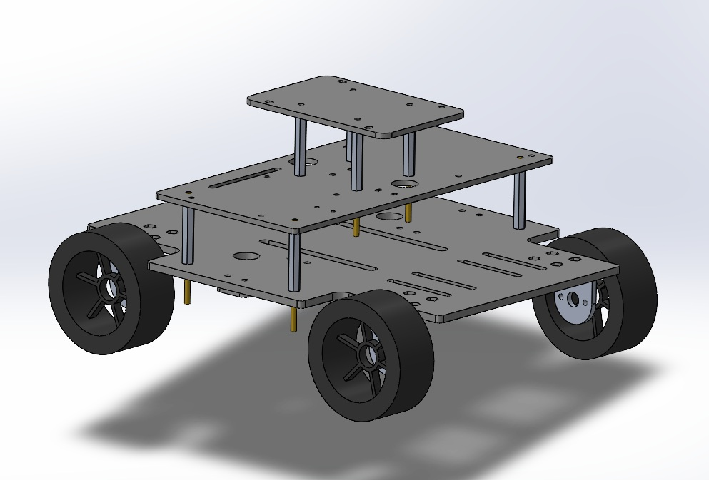
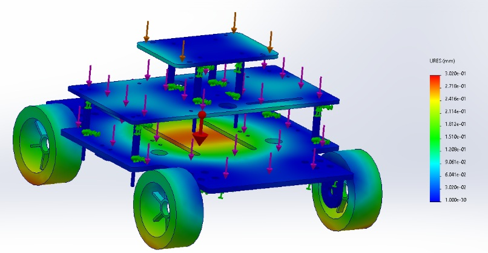
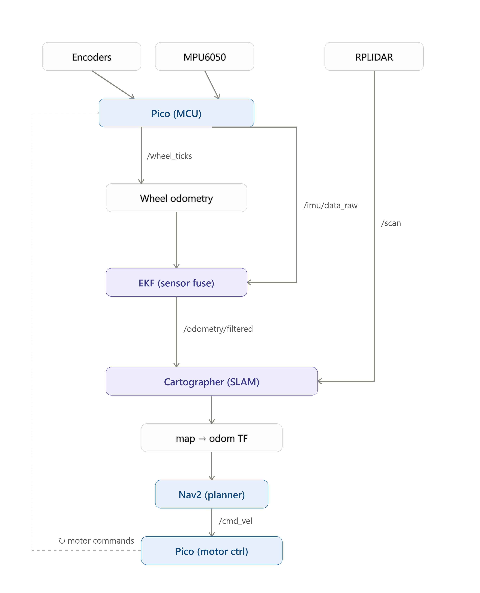
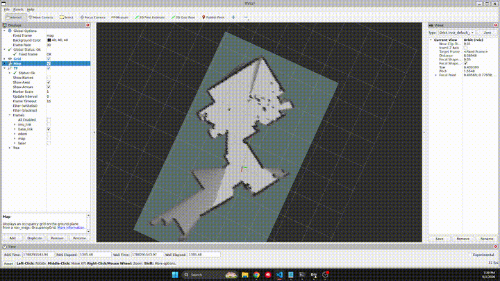
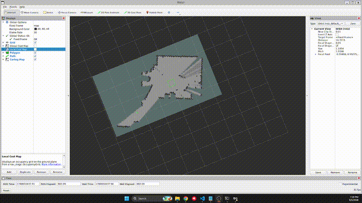
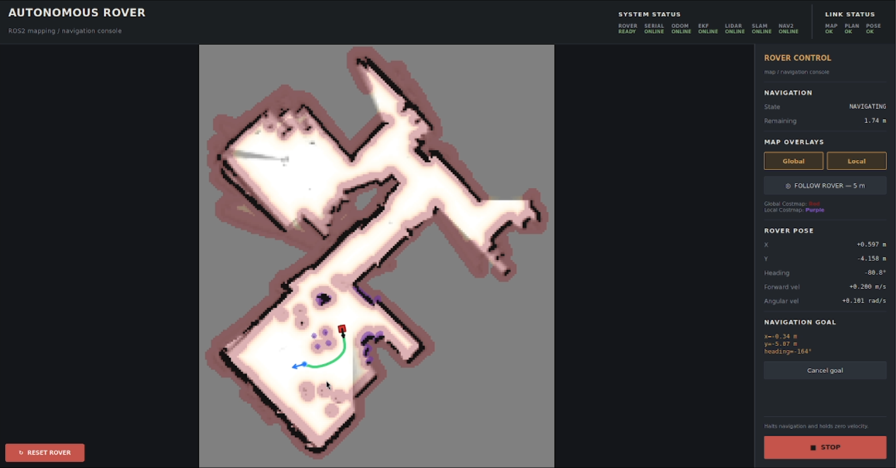

# Autonomous Rover

A fully autonomous indoor mobile robot designed and built for real-time **SLAM, localization, path planning, and obstacle-aware waypoint navigation**.

The rover uses a **Raspberry Pi 4 running ROS 2 Jazzy** for high-level autonomy and a **Raspberry Pi Pico** for real-time motor control, encoder acquisition, and IMU interfacing. A 2D LiDAR, wheel encoders, and IMU provide the sensing required for localization and navigation.

> **Demo Video:** [YouTube link]  
> **Detailed Engineering Documentation:** [📄 View Full Technical Documentation](docs/technical_documentation.pdf)





---

## Features

- Autonomous 2D mapping of previously unknown indoor environments
- Real-time localization using wheel odometry and IMU sensor fusion
- LiDAR-based SLAM using Google Cartographer
- Autonomous waypoint navigation using Nav2
- Global path planning and local obstacle avoidance
- Closed-loop wheel velocity and yaw-rate control
- Custom Raspberry Pi Pico firmware for real-time motor control
- ROS 2 communication architecture across the full autonomy stack
- Automatic rover-stack startup and recovery
- Wireless (WiFi) operator control for mapping, waypoint selection, and emergency stop
- Custom PyQt6 interface for visualization and rover control

---

## System Architecture

The system separates **high-level autonomy** from **real-time control**.

The Raspberry Pi 4 handles localization, SLAM, path planning, and navigation, while the Raspberry Pi Pico handles time-sensitive motor control, encoder acquisition, and IMU communication. This allows the Pico to maintain deterministic low-level control independently of the computational load from SLAM and navigation.



---

## Hardware

| Component | Purpose |
|---|---|
| Raspberry Pi 4 | ROS 2, localization, SLAM, and navigation |
| Raspberry Pi Pico | Real-time motor control and sensor interface |
| RPLIDAR A1 | 360° 2D environment scanning |
| MPU6050 | Gyroscope and accelerometer measurements |
| 4× 12 V DC gear motors | Differential-drive locomotion |
| Quadrature encoders | Wheel velocity and odometry |
| 2× Cytron MD10C | Bidirectional motor control |
| 3S 11.1 V 5200 mAh LiPo | Main system power |
| 5 V buck converter | Regulated compute power |
| Custom 3D-printed chassis | Mechanical structure and component mounting |

The chassis uses a layered layout to separate power distribution, compute/control electronics, and sensing hardware while maintaining a low center of gravity.





---

## Software Stack

The rover runs **Ubuntu 24.04 and ROS 2 Jazzy** on the Raspberry Pi 4.

| Layer | Implementation |
|---|---|
| Motor Control | C / Raspberry Pi Pico SDK |
| Pi ↔ Pico Communication | UART |
| ROS Interface | Custom ROS 2 serial node |
| Wheel Odometry | Custom ROS 2 odometry node |
| Sensor Fusion | `robot_localization` EKF |
| SLAM | Google Cartographer |
| Global Planning | Nav2 / NavFn A* |
| Path Following | Nav2 Regulated Pure Pursuit |
| Obstacle Avoidance | Nav2 local costmap + collision monitoring |
| Operator Interface | PyQt6 + ROS 2 |

### ROS 2 Data Flow



---

## Motion Control

Low-level control runs on the Raspberry Pi Pico independently of ROS 2.

The Pi sends desired linear velocity `v` and angular velocity `ω` over UART. The Pico converts these commands into left/right wheel targets and performs closed-loop control using encoder and gyroscope feedback.

### Wheel Velocity Control

Each side of the differential drivetrain uses PID velocity control at **50 Hz**.

Testing at a 0.4 m/s step input produced:

| Metric | Left | Right |
|---|---:|---:|
| Overshoot | 1.55% | 0.77% |
| Settling time | 0.54 s | 0.62 s |

### Yaw Control

A second control loop uses the MPU6050 gyroscope to correct drivetrain asymmetry and improve heading-rate tracking. The resulting low-level controller combines encoder-based wheel velocity PID with gyroscope-based yaw-rate feedback before generating differential motor commands.

---

## Localization

Wheel encoder measurements provide translational odometry while the MPU6050 gyroscope provides angular velocity. These measurements are fused using the ROS 2 `robot_localization` Extended Kalman Filter.

The EKF was validated over **30 final trials** using RMSE and Normalized Estimation Error Squared (NEES).

| Metric | Final Result |
|---|---:|
| Position RMSE | 5.60 cm |
| Yaw RMSE | 2.47° |
| Average NEES | 2.326 |
| Trials | 30 |

For the three evaluated pose states `(x, y, yaw)`, the expected NEES is 3. The final result of 2.326 indicated slightly conservative covariance estimates and was retained.

---

## SLAM

**Google Cartographer** performs real-time 2D SLAM using:

- RPLIDAR A1 laser scans
- EKF-filtered odometry
- ROS 2 TF transforms

Cartographer performs scan matching and loop-closure optimization while publishing the `map → odom` transform. This allows local odometry to remain continuous while the global pose is corrected as the map is optimized.

```text
map
 └── odom
      └── base_link
           ├── laser
           └── imu_link
```

The resulting occupancy grid is used directly by Nav2 for autonomous navigation.



---

## Autonomous Navigation

The completed map and localization stack feed into **Nav2** for autonomous waypoint navigation.

The navigation stack uses:

- **NavFn with A\*** for global path planning
- **Regulated Pure Pursuit** for path tracking
- Global and local costmaps for obstacle representation
- LiDAR observations for live obstacle detection
- Velocity smoothing and collision monitoring
- Goal and progress checking

A target pose can be selected on the map, after which Nav2 plans and executes the route while continuously responding to nearby obstacles.

Across 40 autonomous waypoint trials spanning open space, multi-turn routes, narrow passages, and obstacle avoidance, the rover reached its goal **85% of the time**, with an average pose error of **7.0 cm** and heading error of **3.5°**.



---

## Operator Interface

A lightweight **PyQt6/ROS 2 interface** was added to operate and monitor the completed autonomy stack.

It provides map and costmap visualization, rover pose and velocity, Nav2 path/goal feedback, waypoint selection, system status, emergency stop, and rover-stack reset controls.



The interface is primarily an operator layer over the ROS 2 system; the autonomy, localization, planning, and control pipelines operate independently underneath it.

---

## System Integration

The complete ROS 2 stack is automatically launched at boot in dependency order:

**Serial Interface → Wheel Odometry → EKF Localization → LiDAR → Cartographer → Nav2**

A custom stack manager monitors subsystem state and allows the autonomy stack to be restarted directly from the operator interface.

---

## Repository Structure

```text
Autonomous-Rover/
│
├── pico/
│   └── ...                  # Pico firmware and motor control
│
├── pi/
│   ├── serial/              # Pi ↔ Pico ROS interface
│   ├── odom/                # Wheel odometry
│   ├── rover_localization/  # EKF configuration
│   ├── rover_slam/          # Cartographer configuration
│   ├── rover_navigation/    # Nav2 configuration
│   └── rover_tools/         # Rover utilities for testing/documentation
│
├── rover_ui/                # Wireless rover control UI
│
├── docs/
│   └── images/
│
└── README.md
```

---

## Demo

### Full Project Demo

[](YOUTUBE_LINK)

The demo covers:

1. Hardware and mechanical design
2. Motor and yaw control
3. Wheel odometry and EKF localization
4. LiDAR SLAM
5. Nav2 path planning and obstacle avoidance
6. Final autonomous navigation

For detailed design decisions, tuning procedures, and experimental results, see the [📄 Full Technical Documentation](docs/technical_documentation.pdf).

---

## Future Work

- Optimize Raspberry Pi 4 compute utilization
- Add dynamic-obstacle tracking
- Validate navigation and SLAM in larger and more complex environments

---

## Technologies

`ROS 2 Jazzy` · `C++` · `C` · `Python` · `Raspberry Pi` · `RP2040` · `Nav2` · `Google Cartographer` · `robot_localization` · `LiDAR` · `UART` · `PID Control` · `EKF` · `SLAM` · `TF2` · `PyQt6`

---

## Author

**Mridul Debnath**  
Mechanical Engineering — Toronto Metropolitan University